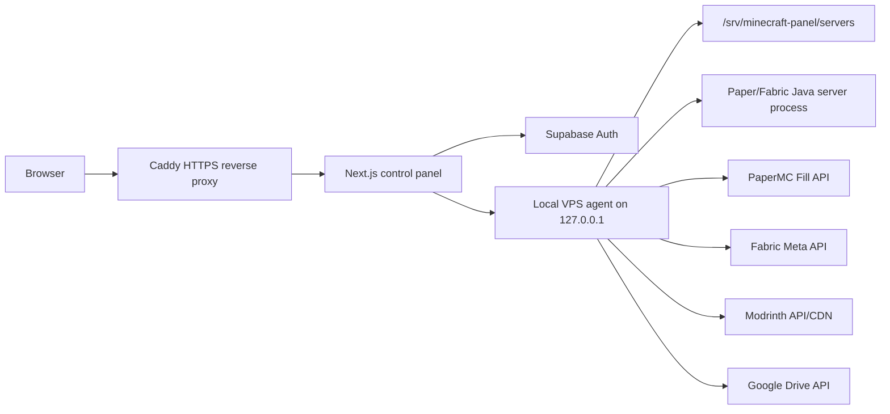

# Z7i Minecraft

A starter architecture for a DigitalOcean Ubuntu VPS that hosts:

- a public HTTPS web control panel
- Supabase Google sign-in
- one owner-managed Minecraft server with 6 GB RAM
- live logs visible to every signed-in user
- Paper server creation using PaperMC's Fill v3 downloads API
- Fabric server creation using Fabric's metadata API
- Modrinth server-side mod installs into `mods/`
- Modrinth Paper plugin installs into `plugins/`
- Modrinth datapack installs into the active world's `datapacks/`
- owner-only file uploads and hover-delete in the Files tab
- one-click server folder ZIP export from the Files tab
- Google Drive OAuth backups every 10 hours, plus manual backup from Settings
- cracked-mode player tracking, playerdata inventory viewing, last coordinates, heal, and kill actions

## Architecture



The important security boundary is that the browser never talks to the agent directly. The web app verifies the Supabase user, checks whether the email is `OWNER_EMAIL`, and then proxies privileged actions to the local agent with `AGENT_TOKEN`.

Google Drive refresh tokens are encrypted by the agent and stored in `MC_PANEL_DATA_DIR/google-drive.json`. Set a long `AGENT_SECRET`; if it is missing, the agent falls back to `AGENT_TOKEN` for encryption.

## Version Sources

The agent does not hard-code Minecraft server jars. On server creation it queries:

- `https://fill.papermc.io/v3/projects/paper`
- `https://meta.fabricmc.net/v2/versions/game`
- `https://meta.fabricmc.net/v2/versions/loader`
- `https://meta.fabricmc.net/v2/versions/installer`

As checked on 2026-05-06, PaperMC reported Paper `26.1.2` build `60`, and Fabric Meta reported latest stable game `26.1.2`, latest game `26.2-snapshot-5`, loader `0.19.2`, and installer `1.1.1`.

## Local Development

1. Install dependencies:

   ```bash
   npm install
   ```

2. Copy env values:

   ```bash
   cp .env.example .env.local
   ```

3. In Supabase, enable Google Auth and add these redirect URLs:

   ```text
   http://localhost:3000/auth/callback
   https://your-domain.com/auth/callback
   ```

4. To enable Google Drive backups, create a Google OAuth web client with the Drive API enabled and add this redirect URL:

   ```text
   http://localhost:3000/api/google-drive/callback
   https://your-domain.com/api/google-drive/callback
   ```

   Set `GOOGLE_DRIVE_CLIENT_ID`, `GOOGLE_DRIVE_CLIENT_SECRET`, and `AGENT_SECRET` in your environment. The panel uses the `drive.file` scope so it can create backup ZIPs through files it owns.

5. Start the local agent:

   ```bash
   AGENT_TOKEN=dev-token npm run dev:agent
   ```

6. Start the web app:

   ```bash
   AGENT_TOKEN=dev-token npm run dev:web
   ```

## DigitalOcean Ubuntu Deployment

1. Create an Ubuntu 24.04 or 26.04 LTS droplet with at least 8 GB RAM. The panel creates one server with 6144 MB allocated.

2. Point your domain's `A` record to the droplet IPv4 address.

3. Install prerequisites:

   ```bash
   sudo apt update
   sudo apt install -y ca-certificates curl git
   curl -fsSL https://deb.nodesource.com/setup_22.x | sudo -E bash -
   sudo apt install -y nodejs
   ```

   Install the Java version required by the server version you create. Paper `26.1.2` currently requires Java 25; older `1.21.x` Paper builds usually require Java 21.
   If Java 25 is installed somewhere other than `java` on PATH, set `JAVA_BINARY=/path/to/java` in `/opt/minecraft-vps-panel/.env`.

4. Install Docker Engine using Docker's official Ubuntu instructions, then clone this repo into `/opt/minecraft-vps-panel`.

5. Create `/opt/minecraft-vps-panel/.env` from `.env.example`, set your Supabase keys, owner email, domain, and a long `AGENT_TOKEN`.

   If you use `supabase/schema.sql`, update `public.panel_settings.owner_email` to match `OWNER_EMAIL`; row-level security policies use it to restrict audit/settings reads.

6. Install dependencies and build the agent:

   ```bash
   cd /opt/minecraft-vps-panel
   npm ci
   npm run build -w apps/agent
   ```

7. Create the runtime user, then install and start the agent as a host service:

   ```bash
   sudo useradd --system --home /srv/minecraft-panel --shell /usr/sbin/nologin minecraft
   sudo mkdir -p /srv/minecraft-panel
   sudo chown -R minecraft:minecraft /srv/minecraft-panel
   sudo cp infra/systemd/minecraft-panel-agent.service /etc/systemd/system/
   sudo systemctl daemon-reload
   sudo systemctl enable --now minecraft-panel-agent
   ```

8. Start the public web stack:

   ```bash
   cd /opt/minecraft-vps-panel
   docker compose -f infra/docker-compose.yml up -d --build
   ```

9. Open firewall ports:

   ```bash
   sudo ufw allow OpenSSH
   sudo ufw allow 80/tcp
   sudo ufw allow 443/tcp
   sudo ufw allow 25565:25600/tcp
   sudo ufw enable
   ```

## Notes

- Paper plugins and Fabric mods are different ecosystems. Create a Paper server for plugins, or a Fabric server for mods.
- The panel writes `online-mode=false` and `enforce-secure-profile=false` because this setup is intended for cracked mode.
- Servers are marked `alwaysOn` by default. The systemd service keeps the Z7i agent running, and the agent auto-starts the Minecraft server on boot and restarts it after crashes with backoff. Pressing Stop in the panel disables always-on until Start or the settings toggle enables it again.
- Offline player heal/kill works by editing `world/playerdata/*.dat` when the player is offline. Online actions use server commands.
- CurseForge requires an API key and some files may not expose direct third-party downloads. Modrinth is the first-class source in this scaffold because its API exposes compatible version files and direct CDN URLs.
- For a public production panel, keep the agent bound to `127.0.0.1`, use a long random `AGENT_TOKEN`, and keep SSH restricted.

## Keeping It 24/7

On the droplet, the chain should look like this:

```bash
sudo systemctl enable --now minecraft-panel-agent
docker compose -f infra/docker-compose.yml up -d --build
```

Check it with:

```bash
sudo systemctl status minecraft-panel-agent
docker compose -f infra/docker-compose.yml ps
```

The web containers restart through Docker Compose, the agent restarts through systemd, and the actual Minecraft Java process restarts through the agent's `alwaysOn` server flag.
