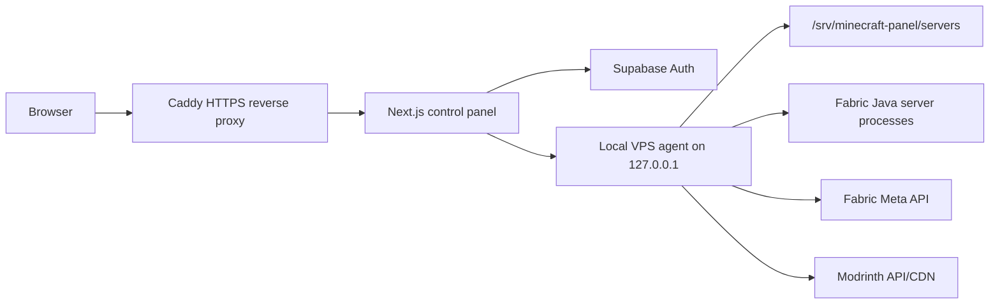

# Minecraft VPS Panel

A starter architecture for a DigitalOcean Ubuntu VPS that hosts:

- a public HTTPS web control panel
- Supabase Google sign-in
- owner-only Minecraft server creation/configuration
- live logs visible to every signed-in user
- Fabric server creation using Fabric's metadata API
- Modrinth add-on search and direct install into a server's `mods/` folder

## Architecture



The important security boundary is that the browser never talks to the agent directly. The web app verifies the Supabase user, checks whether the email is `OWNER_EMAIL`, and then proxies privileged actions to the local agent with `AGENT_TOKEN`.

## Current Fabric Source Of Truth

The agent does not hard-code a Minecraft/Fabric version. On server creation it queries:

- `https://meta.fabricmc.net/v2/versions/game`
- `https://meta.fabricmc.net/v2/versions/loader`
- `https://meta.fabricmc.net/v2/versions/installer`

As checked on 2026-05-05, Fabric Meta reported latest stable game `26.1.2`, latest game `26.2-snapshot-5`, latest loader `0.19.2`, and latest installer `1.1.1`. The panel defaults to the latest stable game.

## Local Development

1. Install dependencies:

   ```bash
   npm install
   ```

2. Copy env values:

   ```bash
   cp .env.example .env.local
   ```

3. In Supabase, enable Google Auth and add these redirect URLs:

   ```text
   http://localhost:3000/auth/callback
   https://your-domain.com/auth/callback
   ```

4. Start the local agent:

   ```bash
   AGENT_TOKEN=dev-token npm run dev:agent
   ```

5. Start the web app:

   ```bash
   AGENT_TOKEN=dev-token npm run dev:web
   ```

## DigitalOcean Ubuntu Deployment

1. Create an Ubuntu 24.04 or 26.04 LTS droplet with at least 4 GB RAM for a small modded server. Use 8 GB+ if you expect heavier modpacks.

2. Point your domain's `A` record to the droplet IPv4 address.

3. Install prerequisites:

   ```bash
   sudo apt update
   sudo apt install -y ca-certificates curl git openjdk-21-jre-headless
   curl -fsSL https://deb.nodesource.com/setup_22.x | sudo -E bash -
   sudo apt install -y nodejs
   ```

4. Install Docker Engine using Docker's official Ubuntu instructions, then clone this repo into `/opt/minecraft-vps-panel`.

5. Create `/opt/minecraft-vps-panel/.env` from `.env.example`, set your Supabase keys, owner email, domain, and a long `AGENT_TOKEN`.

6. Install dependencies and build the agent:

   ```bash
   cd /opt/minecraft-vps-panel
   npm ci
   npm run build -w apps/agent
   ```

7. Create the runtime user, then install and start the agent as a host service:

   ```bash
   sudo useradd --system --home /srv/minecraft-panel --shell /usr/sbin/nologin minecraft
   sudo mkdir -p /srv/minecraft-panel
   sudo chown -R minecraft:minecraft /srv/minecraft-panel
   sudo cp infra/systemd/minecraft-panel-agent.service /etc/systemd/system/
   sudo systemctl daemon-reload
   sudo systemctl enable --now minecraft-panel-agent
   ```

8. Start the public web stack:

   ```bash
   cd /opt/minecraft-vps-panel
   docker compose -f infra/docker-compose.yml up -d --build
   ```

9. Open firewall ports:

   ```bash
   sudo ufw allow OpenSSH
   sudo ufw allow 80/tcp
   sudo ufw allow 443/tcp
   sudo ufw allow 25565:25600/tcp
   sudo ufw enable
   ```

## Notes

- Fabric uses mods, not Bukkit/Paper plugins. The UI calls them add-ons so future Paper/Hangar or CurseForge adapters can fit without confusing the control panel.
- CurseForge requires an API key and some files may not expose direct third-party downloads. Modrinth is the first-class source in this scaffold because its API exposes compatible version files and direct CDN URLs.
- For a public production panel, keep the agent bound to `127.0.0.1`, use a long random `AGENT_TOKEN`, and keep SSH restricted.
